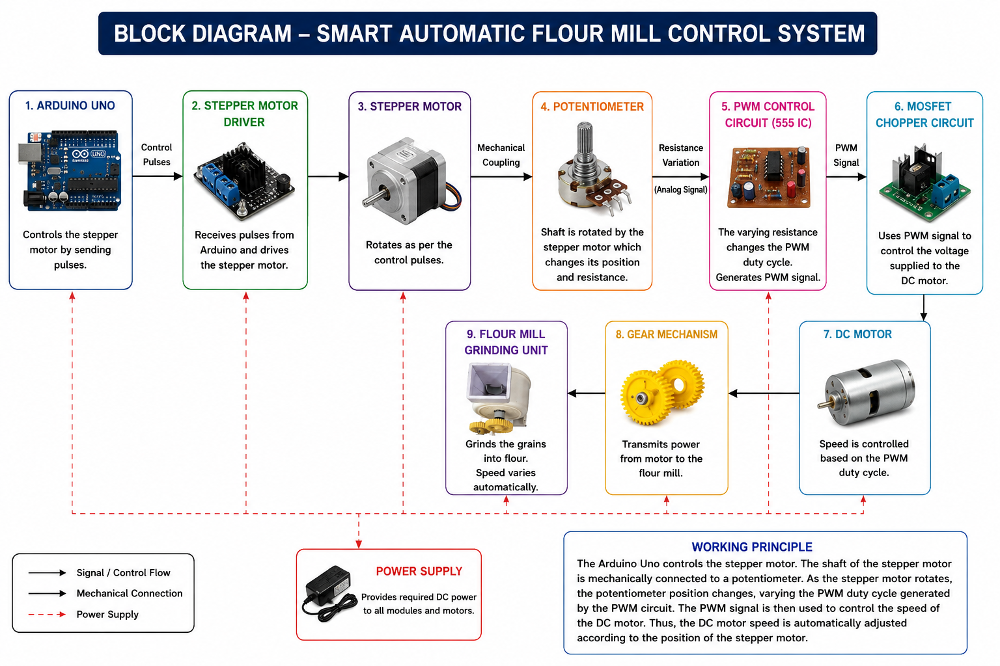

# Smart Automatic Flour Mill Control System

An Arduino-based automated flour mill control system that regulates the grinding motor speed using a stepper motor-controlled potentiometer and PWM control technique. The system allows digital speed adjustment through a keypad interface, providing accurate and efficient flour milling operation.

---

## Project Overview

Traditional flour mills often rely on manual speed adjustment, which can lead to inconsistent grinding performance. This project introduces an automated speed control mechanism using an Arduino Uno, a stepper motor, a potentiometer, and a PWM control circuit.

The Arduino receives user commands through a keypad and drives a stepper motor. The stepper motor is mechanically coupled to a potentiometer, whose resistance variation changes the PWM duty cycle generated by the PWM circuit. The PWM signal controls the DC motor speed, thereby regulating the flour mill grinding process.

---

## System Block Diagram



---

## Hardware Prototype

### Prototype View 1


### Prototype View 2


---

## Hardware Components

| Component | Description |
|------------|------------|
| Arduino Uno | Main controller |
| 4×4 Keypad | User input interface |
| Stepper Motor Driver | Drives the stepper motor |
| Stepper Motor | Controls potentiometer position |
| Potentiometer | Adjusts PWM duty cycle |
| PWM Circuit (555 Timer IC) | Generates PWM signal |
| MOSFET Chopper Circuit | Controls DC motor voltage |
| DC Motor | Drives flour mill mechanism |
| Gear Mechanism | Transfers mechanical power |
| Flour Mill Grinding Unit | Grinding operation |
| Power Supply | Provides DC power |

---

## Working Principle

1. The user enters a speed command using the keypad.
2. Arduino Uno processes the command.
3. Arduino sends control pulses to the stepper motor driver.
4. The stepper motor rotates according to the input command.
5. The stepper motor shaft is mechanically coupled to a potentiometer.
6. Potentiometer resistance changes with shaft position.
7. The PWM control circuit generates a corresponding PWM signal.
8. The MOSFET chopper circuit uses the PWM signal to regulate motor voltage.
9. The DC motor speed changes according to the PWM duty cycle.
10. The gear mechanism transfers power to the flour mill grinding unit.

---

## System Architecture

```text
Keypad
   │
   ▼
Arduino Uno
   │
   ▼
Stepper Motor Driver
   │
   ▼
Stepper Motor
   │
Mechanical Coupling
   ▼
Potentiometer
   │
   ▼
PWM Control Circuit (555 Timer)
   │
   ▼
MOSFET Chopper Circuit
   │
   ▼
DC Motor
   │
   ▼
Gear Mechanism
   │
   ▼
Flour Mill Grinding Unit
```

---

## Features

- Digital speed control
- Keypad-based operation
- Arduino-based automation
- PWM motor speed regulation
- Stepper motor positioning control
- Low-cost implementation
- User-friendly design
- Suitable for educational and industrial applications

---

## Advantages

- Accurate motor speed control
- Improved grinding efficiency
- Reduced manual intervention
- Low power consumption
- Reliable operation
- Expandable architecture

---

## Applications

- Flour milling systems
- Grain processing machines
- Agricultural automation
- Educational embedded systems projects
- Industrial motor control systems

---

## Software Requirements

- Arduino IDE
- Embedded C/C++
- Arduino Libraries for Keypad and Stepper Motor Control

---

## Future Enhancements

- IoT-based monitoring and control
- Mobile application interface
- LCD display for speed indication
- Automatic grain feed control
- AI-based load optimization
- Remote data logging

---

## Repository Structure

```text
Smart-Automatic-Flour-Mill-Control-System/
│
├── Arduino_Code/
│   └── flour_mill_control.ino
│
├── Circuit_Diagram/
│   └── circuit_diagram.png
│
├── Block_Diagram/
│   └── block_diagram.png
│
├── Images/
│   ├── prototype1.jpg
│   └── prototype2.jpg
│
└── README.md
```

---

## Author

**Supreet Hulloli**  
Bachelor of Engineering (Electrical and Electronics Engineering)

---

## License

This project is developed for educational, research, and demonstration purposes.
